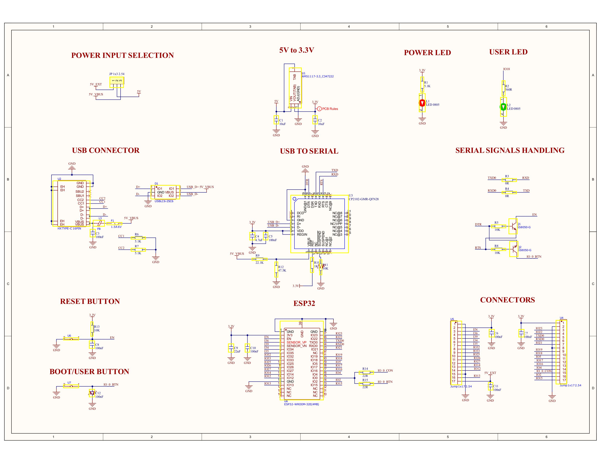
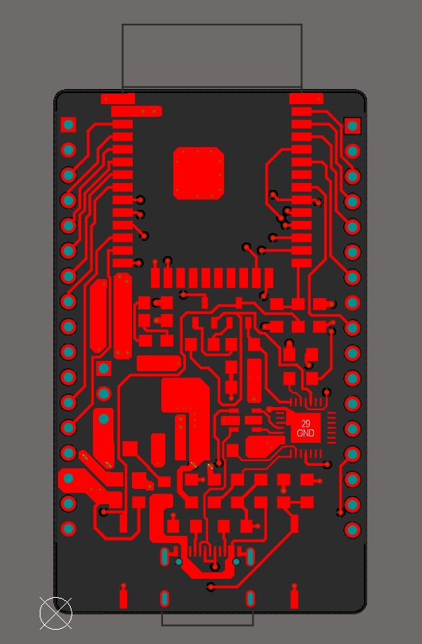
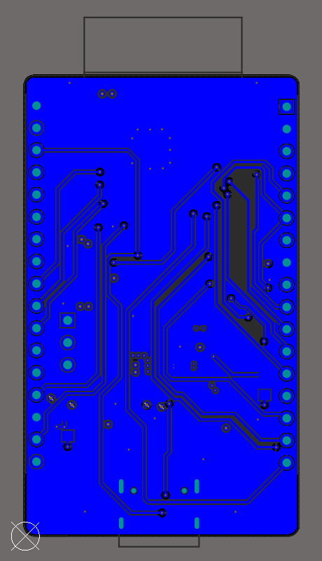
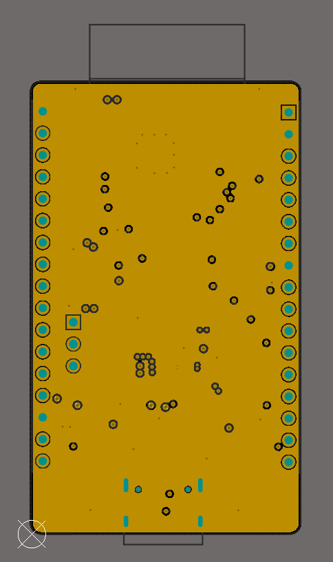
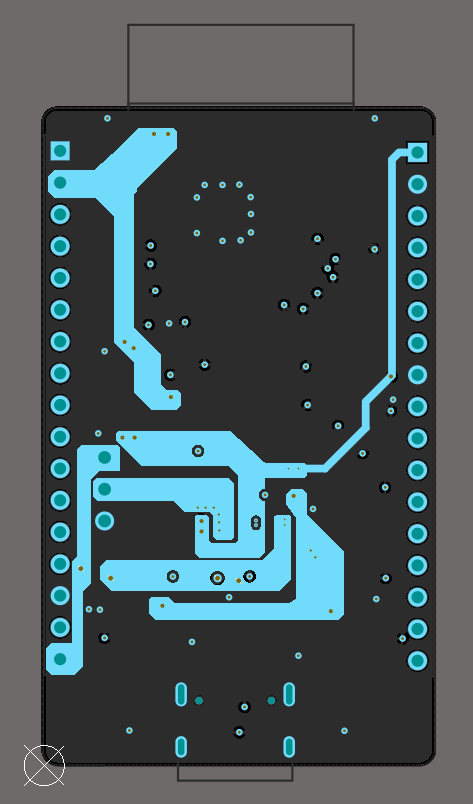
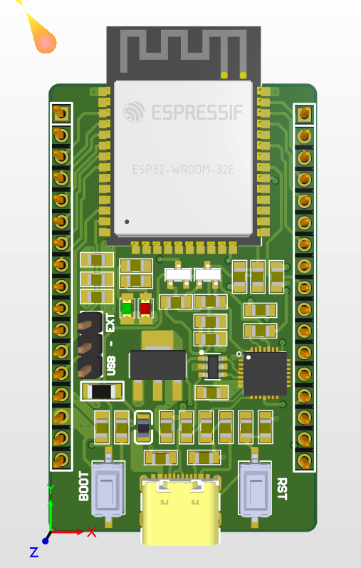
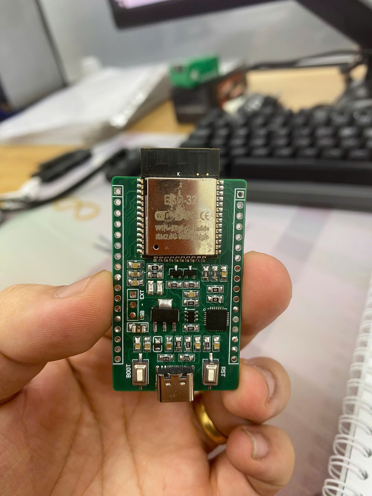

# My Own ESP32 - Custom Development Board

## Acknowledgement

Special thanks to **Mr. Vu Duc Tuan** for generously sponsoring the electronic components and PCB fabrication costs for this project. This board would not have been possible without his support.

---

## 1. Overview

This is a custom ESP32 development board designed entirely from scratch using Altium Designer. The board is built around the ESP32-WROOM-32E module and includes all the necessary circuitry for USB programming, power regulation, and GPIO access — similar in concept to commercial dev boards but fully hand-designed.

---

## 2. Features

- ESP32-WROOM-32E (4 MB flash) as the main microcontroller
- USB Type-C connector for power supply and firmware programming
- CP2102 USB-to-Serial bridge for communication between PC and ESP32
- Auto-reset circuit using SS8050 NPN transistors controlled via DTR/RTS signals
- AMS1117-3.3 LDO voltage regulator (5V to 3.3V, up to 1A)
- Power input selection via jumper (USB VBUS or external 5V)
- Power indicator LED (red) and user-programmable LED (green, GPIO18)
- Reset button (EN) and Boot/Flash button (GPIO0)
- Two 17-pin expansion headers exposing all available GPIO pins
- 4-layer PCB with dedicated GND and PWR internal planes

---

## 3. Schematic

---

## 4. PCB Layers

### Top Layer

### Bottom Layer

### GND Plane (Inner Layer 1)

### PWR Plane (Inner Layer 2)

### 3D View (Altium Designer)

### Assembled Product

---

## 5. Project Files

| File / Folder | Description |
|---|---|
| `My_esp.SchDoc` | Altium Designer schematic source file |
| `My_esp.PcbDoc` | Altium Designer PCB layout source file |
| `My_own_esp32(2).PrjPcb` | Altium Designer project file |
| `My_own_esp32(2).OutJob` | Output job configuration (Gerber, drill files, etc.) |
| `Project Outputs for My_own_esp32(2)/` | Generated Gerber and drill files ready for fabrication |
| `PDNAnalyzer_Output/` | Power Delivery Network analysis results |
| `Picture/` | Schematic and PCB layer images |

---

## 6. Tools Used

- **Altium Designer** — Schematic capture, PCB layout, and Gerber generation

---

## 7. Lessons Learned

- **Reading component datasheets** — Learned to extract key application circuits, recommended footprints, and electrical characteristics directly from datasheets for components such as the ESP32-WROOM-32E, CP2102, AMS1117, and SS8050.
- **Using PDN Analyzer** — Gained hands-on experience running Power Delivery Network analysis in Altium Designer to verify that power traces and planes can supply sufficient current with acceptable voltage drop across the board.
- **Copper pour with P+G (Polygon Pour)** — Learned to use Altium's polygon pour feature to flood copper on power and ground nets, improving current capacity, reducing impedance on power rails, and providing better EMI shielding across the board.
